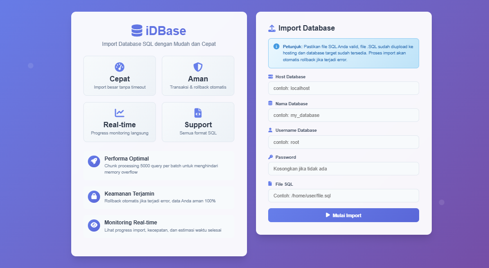

# iDBase - Import Database SQL


**iDBase** adalah tool PHP yang memudahkan **import database SQL dengan cepat dan aman**, cocok untuk file SQL besar, mendukung rollback otomatis, dan monitoring real-time.

---

## 🌟 Fitur Utama

-  **Performa Optimal** – Chunk processing 5000 query per batch untuk menghindari memory overflow.  
-  **Keamanan Terjamin** – Rollback otomatis jika terjadi error.  
-  **Monitoring Real-time** – Lihat progress import, kecepatan, dan estimasi waktu selesai.  
-  **Support Semua Format SQL** – Kompatibel dengan MySQL/MariaDB.  
-  **User-friendly Interface** – Tampilan modern berbasis HTML/CSS + Font Awesome.  

---

## 🖼️ Contoh Tampilan iDBase




---

## ⚙️ Instalasi

1. Clone repo:

```bash
git clone https://github.com/username/iDBase.git
